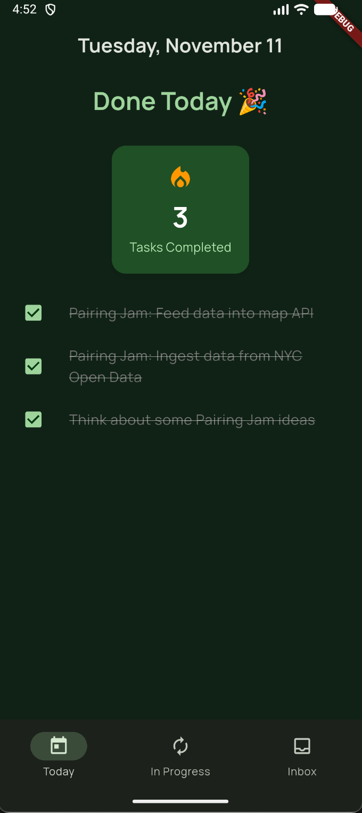
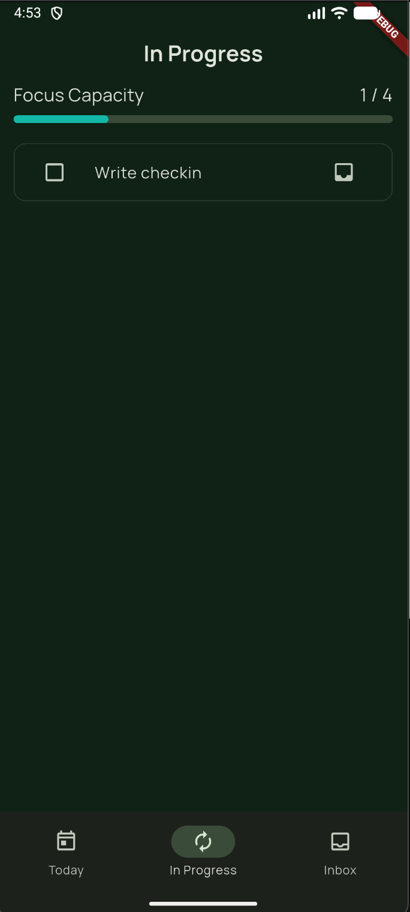

# Finite Todos

Finite Todos is a simple todo app that reckons with the limits of human finitude, inspired by Oliver Burkeman's [Four Thousand Weeks](https://www.oliverburkeman.com/fourthousandweeks). Finite Todos does this by:

* **Expiring todos after 7 days** - The universe of things we could be doing will always eclipse our capacity.
* **Limiting to 4 in-progress todos** - We have limited capacity for focus in the here and now.
* **Prominently displaying today's completed todos** - Take a moment (or several) to celebrate today's wins, instead of always being future-focused.

## Screenshots

### Today's Completed Tasks

*Celebrate your daily accomplishments with a clear view of completed tasks.*

### In Progress

*Focus on what matters now with a limit of 4 active tasks.*

### Inbox

*Capture new tasks with automatic 7-day expiration to prevent endless accumulation.*